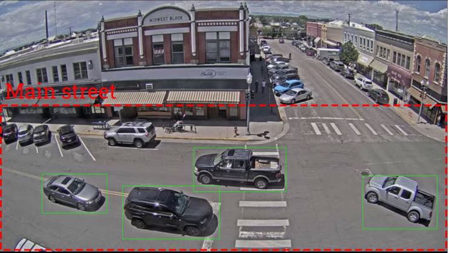
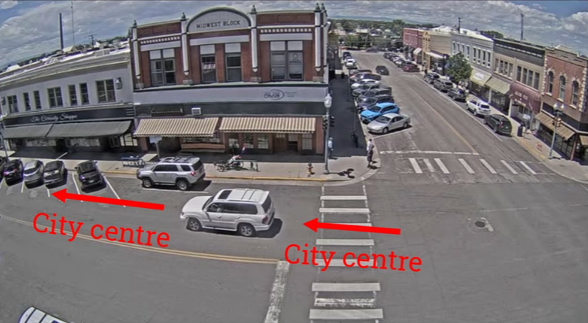

# Traffic Camera

## About

This application uses frame differencing and background subtraction techniques to detect cars on the road. Exercise 1.1 counts the number of cars on the main street, and Exercise 1.2 counts the number of cars going towards the city centre. Two implementations were carried out to achieve a better result.

**Exercise 1.1**

**Exercise 1.2**

## How it works

Each frame of the video is converted to grayscale and Gaussian blur is applied. The blur frame is then compared to the initial frame, and the difference appears as white in the threshold frame.

## First implementation

The first implementation of the application involved counting the total number of rectangles drawn in the video. However, it was noticed that many overlapping rectangles were being drawn for a single car, resulting in many false positives.

|                       | **Task**    | **Expected number of cars** | **Counted number of cars** |
| --------------------- | ----------- | --------------------------- | -------------------------- |
| Traffic_Laramie_1.mp4 | Main street | 24                          | 81                         |
| Traffic_Laramie_2.mp4 | Main street | 15                          | 92                         |
| Traffic_Laramie_1.mp4 | City centre | 6                           | 17                         |
| Traffic_Laramie_2.mp4 | City centre | 4                           | 9                          |

## Second implementation

The second implementation of the application involved removing the overlapping rectangles in each frame if the video. This resulted in a much more accurate result.

|                       | **Task**    | **Expected number of cars** | **Counted number of cars** |
| --------------------- | ----------- | --------------------------- | -------------------------- |
| Traffic_Laramie_1.mp4 | Main street | 24                          | 30                         |
| Traffic_Laramie_2.mp4 | Main street | 15                          | 42                         |
| Traffic_Laramie_1.mp4 | City centre | 6                           | 11                         |
| Traffic_Laramie_2.mp4 | City centre | 4                           | 9                          |
